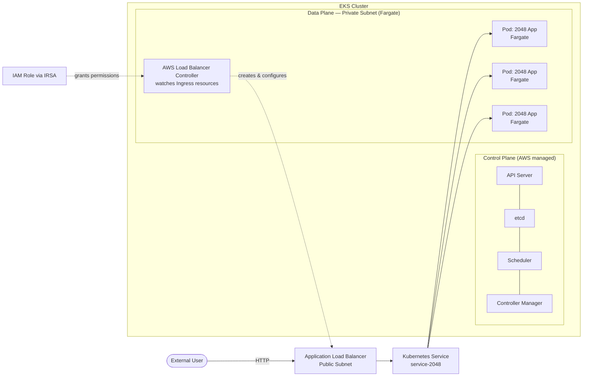

<div align="center">

# 🎮 Deploying a Containerized Application on Amazon EKS with Fargate & AWS Load Balancer Controller

### End-to-end deployment of the **2048 game** on a production-style Kubernetes architecture using **Amazon EKS**, **AWS Fargate**, **Kubernetes Ingress**, and the **AWS Load Balancer Controller**.


</div>

---

## 📌 Table of Contents

- [Overview](#-overview)
- [Architecture](#-architecture)
- [Tech Stack](#-tech-stack)
- [Prerequisites](#-prerequisites)
- [Repository Structure](#-repository-structure)
- [Screenshots Checklist](#-screenshots-checklist-add-these-to-the-repo)
- [Step-by-Step Deployment Guide](#-step-by-step-deployment-guide)
  - [1. Install & Configure CLI Tools](#1-install--configure-cli-tools)
  - [2. Create the EKS Cluster](#2-create-the-eks-cluster)
  - [3. Explore the Cluster](#3-explore-the-cluster)
  - [4. Create a Fargate Profile](#4-create-a-fargate-profile)
  - [5. Deploy the Application](#5-deploy-the-application)
  - [6. Install the AWS Load Balancer Controller](#6-install-the-aws-load-balancer-controller)
  - [7. Verify the Load Balancer & Access the App](#7-verify-the-load-balancer--access-the-app)
- [Troubleshooting](#-troubleshooting)
- [Cleanup](#-cleanup--avoid-unnecessary-billing)
- [Key Learnings](#-key-learnings)
- [References](#-references)
- [Author](#-author)

---

## 🧭 Overview

This project provisions a fully managed **Amazon EKS** cluster with **AWS Fargate** as the compute layer (no EC2 worker nodes to patch or scale manually), deploys the classic **2048 game** as a containerized workload, and exposes it to the public internet through a Kubernetes **Ingress** resource backed by the **AWS Load Balancer Controller**, which automatically provisions and configures an **Application Load Balancer (ALB)**.

**What this demonstrates:**
- Setting up a managed Kubernetes control plane on AWS (EKS)
- Running workloads on **serverless** compute (Fargate) instead of self-managed EC2 nodes
- Namespace-scoped Fargate Profiles
- Kubernetes `Deployment`, `Service`, and `Ingress` manifests
- IAM ↔ Kubernetes integration via **IAM OIDC** + **IRSA** (IAM Roles for Service Accounts)
- Installing and operating the **AWS Load Balancer Controller** via Helm
- End-to-end external traffic flow: **User → ALB (public subnet) → Service → Pod (private subnet)**

---

## 🏗 Architecture



| Layer | Component |
|---|---|
| **Control Plane** | Fully managed by AWS EKS (API Server, etcd, Scheduler, Controller Manager) |
| **Data Plane** | AWS Fargate (serverless — no EC2 worker nodes) |
| **Networking** | VPC with public + private subnets (auto-created by `eksctl`) |
| **Ingress** | `Ingress` resource + AWS Load Balancer Controller → Application Load Balancer |
| **IAM Integration** | IAM OIDC provider + IAM Role for Service Account (IRSA) |

---

## 🛠 Tech Stack

| Tool | Purpose |
|---|---|
| **Amazon EKS** | Managed Kubernetes control plane |
| **AWS Fargate** | Serverless compute for pods (data plane) |
| **kubectl** | Kubernetes CLI |
| **eksctl** | CLI to create/manage EKS clusters |
| **AWS CLI** | AWS authentication & resource management |
| **Helm** | Package manager used to install the AWS Load Balancer Controller |
| **AWS Load Balancer Controller** | Watches Ingress resources and provisions ALBs |
| **Docker (2048 game image)** | Containerized application deployed to the cluster |

---

## ✅ Prerequisites

Make sure the following are installed and configured **before** starting:

| Tool | Install Guide |
|---|---|
| `kubectl` | [Kubernetes official docs](https://kubernetes.io/docs/tasks/tools/) |
| `eksctl` | [eksctl.io Installation](https://eksctl.io/installation/) |
| `AWS CLI` | [AWS CLI User Guide](https://docs.aws.amazon.com/cli/latest/userguide/getting-started-install.html) |
| `Helm` | [Helm Installation](https://helm.sh/docs/intro/install/) |
| An AWS account with sufficient IAM permissions | — |

Configure the AWS CLI with your credentials:

```bash
aws configure
# AWS Access Key ID
# AWS Secret Access Key
# Default region name (e.g. us-east-1)
# Default output format (json)
```

> ⚠️ **Note:** Use an IAM user with appropriate permissions (EKS, EC2, IAM, ELB) rather than the root account in real/production environments.

---

## 📁 Repository Structure

```
.
├── README.md
├── manifests/
│   ├── namespace.yaml
│   ├── deployment.yaml
│   ├── service.yaml
│   └── ingress.yaml
├── iam/
│   └── iam-policy.json
└── screenshots/
    ├── 01-cluster-creation-terminal.png
    ├── 02-eks-console-cluster-active.png
    ├── 03-cluster-overview-endpoint-oidc.png
    ├── 04-resources-tab.png
    ├── 05-fargate-profile-console.png
    ├── 06-fargate-profile-created-terminal.png
    ├── 07-pods-running.png
    ├── 08-service-created.png
    ├── 09-ingress-no-address.png
    ├── 10-oidc-provider-associated.png
    ├── 11-iam-policy-created.png
    ├── 12-iam-service-account-created.png
    ├── 13-helm-install-output.png
    ├── 14-alb-controller-2-2-ready.png
    ├── 15-alb-created-ec2-console.png
    ├── 16-alb-active-state.png
    ├── 17-ingress-with-address.png
    └── 18-app-live-in-browser.png
```

---

## 📸 Screenshots Checklist (add these to the repo)

Create a `screenshots/` folder in your repo root and capture the following **18 screenshots** as you go through the deployment. Use the exact filenames below (or update the paths in this README to match yours) so the embedded images render correctly on GitHub.

| # | Filename | What to Capture |
|---|---|---|
| 1 | !(01-cluster-creation-terminal-1.png) | Terminal output of `eksctl create cluster` completing successfully |
| 2 | `02-eks-console-cluster-active.png` | AWS Console → EKS → Clusters, showing your cluster with **Active** status |
| 3 | `03-cluster-overview-endpoint-oidc.png` | Cluster **Overview** tab showing the API server endpoint and OIDC provider URL |
| 4 | `04-resources-tab.png` | Cluster **Resources** tab listing pods/namespaces in the console |
| 5 | `05-fargate-profile-console.png` | Cluster **Compute** tab showing the Fargate profile for `game-2048` |
| 6 | `06-fargate-profile-created-terminal.png` | Terminal output confirming Fargate profile creation |
| 7 | `07-pods-running.png` | Output of `kubectl get pods -n game-2048` — all pods **Running** |
| 8 | `08-service-created.png` | Output of `kubectl get svc -n game-2048` |
| 9 | `09-ingress-no-address.png` | Output of `kubectl get ingress -n game-2048` **before** the ALB controller is installed (empty ADDRESS column) |
| 10 | `10-oidc-provider-associated.png` | Console or terminal confirmation of `eksctl utils associate-iam-oidc-provider` |
| 11 | `11-iam-policy-created.png` | IAM Console → Policies, showing `AWSLoadBalancerControllerIAMPolicy` |
| 12 | `12-iam-service-account-created.png` | Terminal output of `eksctl create iamserviceaccount` succeeding |
| 13 | `13-helm-install-output.png` | Terminal output of `helm install aws-load-balancer-controller` succeeding |
| 14 | `14-alb-controller-2-2-ready.png` | Output of `kubectl get deploy aws-load-balancer-controller -n kube-system` showing **2/2** ready |
| 15 | `15-alb-created-ec2-console.png` | EC2 Console → Load Balancers, showing the new `k8s-game2048-...` ALB |
| 16 | `16-alb-active-state.png` | Same load balancer with **State = Active** |
| 17 | `17-ingress-with-address.png` | Output of `kubectl get ingress -n game-2048` **after** the ALB is provisioned (ADDRESS populated) |
| 18 | `18-app-live-in-browser.png` | Browser screenshot of the 2048 game running live at the ALB's DNS URL |

---

## 🚀 Step-by-Step Deployment Guide

### 1. Install & Configure CLI Tools

Install `kubectl`, `eksctl`, `AWS CLI`, and `Helm` as listed in [Prerequisites](#-prerequisites), then run `aws configure`.

---

### 2. Create the EKS Cluster

```bash
eksctl create cluster \
  --name demo-cluster-1 \
  --region us-east-1 \
  --fargate
```

This single command:
- Provisions a fully managed EKS control plane
- Creates a VPC with public and private subnets
- Sets up Fargate as the data plane (no EC2 worker nodes required)

> ⏱ Cluster creation typically takes **10–20 minutes**.

📸 *Insert `01-cluster-creation-terminal.png` here*

Verify in the console:

📸 *Insert `02-eks-console-cluster-active.png` here*

📸 *Insert `03-cluster-overview-endpoint-oidc.png` here*

Update your local kubeconfig to point `kubectl` at the new cluster:

```bash
aws eks update-kubeconfig --name demo-cluster-1 --region us-east-1
```

---

### 3. Explore the Cluster

Browse pods and resources directly from the console:

📸 *Insert `04-resources-tab.png` here*

---

### 4. Create a Fargate Profile

Fargate requires an explicit profile per namespace before pods can be scheduled into it.

```bash
eksctl create fargateprofile \
  --cluster demo-cluster-1 \
  --region us-east-1 \
  --name alb-sample-app \
  --namespace game-2048
```

📸 *Insert `06-fargate-profile-created-terminal.png` here*

📸 *Insert `05-fargate-profile-console.png` here*

---

### 5. Deploy the Application

Apply the namespace, deployment, service, and ingress manifests (see [`manifests/`](./manifests)):

```bash
kubectl apply -f manifests/namespace.yaml
kubectl apply -f manifests/deployment.yaml
kubectl apply -f manifests/service.yaml
kubectl apply -f manifests/ingress.yaml
```

Verify each resource:

```bash
kubectl get pods -n game-2048
kubectl get svc -n game-2048
kubectl get ingress -n game-2048
```

📸 *Insert `07-pods-running.png` here*

📸 *Insert `08-service-created.png` here*

📸 *Insert `09-ingress-no-address.png` here — note the ADDRESS column is empty because no Ingress Controller is installed yet*

---

### 6. Install the AWS Load Balancer Controller

**Step 1 — Associate an IAM OIDC provider with the cluster:**

```bash
eksctl utils associate-iam-oidc-provider \
  --cluster demo-cluster-1 \
  --approve
```

📸 *Insert `10-oidc-provider-associated.png` here*

**Step 2 — Create the IAM policy:**

```bash
aws iam create-policy \
  --policy-name AWSLoadBalancerControllerIAMPolicy \
  --policy-document file://iam/iam-policy.json
```

📸 *Insert `11-iam-policy-created.png` here*

**Step 3 — Create an IAM role bound to a Kubernetes service account (IRSA):**

```bash
eksctl create iamserviceaccount \
  --cluster demo-cluster-1 \
  --namespace kube-system \
  --name aws-load-balancer-controller \
  --attach-policy-arn arn:aws:iam::<ACCOUNT_ID>:policy/AWSLoadBalancerControllerIAMPolicy \
  --approve
```

📸 *Insert `12-iam-service-account-created.png` here*

**Step 4 — Install the controller via Helm:**

```bash
helm repo add eks https://aws.github.io/eks-charts
helm repo update eks

helm install aws-load-balancer-controller eks/aws-load-balancer-controller \
  -n kube-system \
  --set clusterName=demo-cluster-1 \
  --set serviceAccount.create=false \
  --set serviceAccount.name=aws-load-balancer-controller \
  --set region=us-east-1 \
  --set vpcId=<YOUR_VPC_ID>
```

📸 *Insert `13-helm-install-output.png` here*

**Step 5 — Verify the controller is healthy (2/2 ready replicas):**

```bash
kubectl get deploy aws-load-balancer-controller -n kube-system
```

📸 *Insert `14-alb-controller-2-2-ready.png` here*

---

### 7. Verify the Load Balancer & Access the App

Check that the Ingress now has an address:

```bash
kubectl get ingress -n game-2048
```

📸 *Insert `17-ingress-with-address.png` here*

Confirm the ALB in the AWS Console:

📸 *Insert `15-alb-created-ec2-console.png` here*

📸 *Insert `16-alb-active-state.png` here*

Open the ALB's DNS name in a browser — the 2048 game should load:

📸 *Insert `18-app-live-in-browser.png` here*

---

## 🐛 Troubleshooting

| Issue | Cause | Fix |
|---|---|---|
| `eksctl create cluster` fails — cluster name already exists | Leftover cluster from a previous attempt | Rename the cluster or delete the old one first |
| `aws iam create-policy` fails — entity already exists | Policy from a prior run wasn't cleaned up | Delete the old policy (IAM Console → Policies) and recreate |
| `eksctl create iamserviceaccount` errors about a CloudFormation stack | Stale CloudFormation stack from an earlier failed attempt | Delete the stack in CloudFormation console, then retry (optionally rename the service account) |
| ALB controller stuck at `0/2` ready | Pod is "Forbidden" — service account wasn't created properly | `kubectl describe pod <pod> -n kube-system` to confirm; recreate the service account with `--override-existing-serviceaccounts` |
| `helm install` fails — "unexpected arguments" | Stray whitespace in the command | Remove extra spaces and re-run |
| `helm install` fails — release name already in use | Leftover release from a failed prior install | `helm delete aws-load-balancer-controller -n kube-system`, then reinstall |

---

## 🧹 Cleanup — Avoid Unnecessary Billing

```bash
kubectl delete -f manifests/ingress.yaml
kubectl delete -f manifests/service.yaml
kubectl delete -f manifests/deployment.yaml
kubectl delete -f manifests/namespace.yaml

helm uninstall aws-load-balancer-controller -n kube-system

eksctl delete fargateprofile --cluster demo-cluster-1 --name alb-sample-app --region us-east-1
eksctl delete cluster --name demo-cluster-1 --region us-east-1
```

> ⚠️ Confirm in the EC2 and EKS consoles that the ALB, cluster, and associated resources are actually deleted to avoid ongoing charges.

---

## 🎓 Key Learnings

- **EKS manages the control plane only** — you still choose and own how the data plane (EC2 or Fargate) runs.
- **Fargate** removes worker-node management entirely, but needs a **Fargate Profile per namespace**.
- **ClusterIP** and **NodePort** Services can't economically serve public traffic at scale — **Ingress + an Ingress Controller** is the standard pattern.
- The **AWS Load Balancer Controller** is what actually turns a Kubernetes `Ingress` resource into a real, working Application Load Balancer.
- On EKS specifically, the ALB controller needs **IAM OIDC + an IAM policy + an IRSA-bound service account** before it can create AWS resources — this IAM integration step is the main difference vs. a plain on-premises cluster, where RBAC alone would suffice.

---

## 📚 References

- [Amazon EKS Documentation](https://docs.aws.amazon.com/eks/)
- [eksctl Documentation](https://eksctl.io/)
- [AWS Load Balancer Controller — GitHub](https://github.com/kubernetes-sigs/aws-load-balancer-controller)
- [Kubernetes Ingress Documentation](https://kubernetes.io/docs/concepts/services-networking/ingress/)
- [AWS DevOps Zero to Hero — Abhishek Veeramalla (YouTube Series)](https://www.youtube.com/@AbhishekVeeramalla)

---

## 👤 Author

**Neha**
Final-year ECE student | Transitioning into Cloud Computing & Cloud Security | AWS Certified

---

<div align="center">

⭐ If you found this project useful, consider giving the repo a star!

</div>
